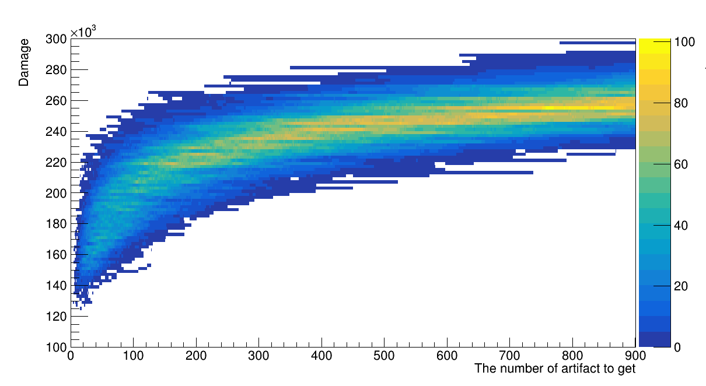

# Genshin-Artifact-Simulator
This project is for the simulation of "How much resine you need to get artifacts good enough in Genshin Impact".

# Dependencies
You should have ROOT(CERN) libraries.

# Status
It doesn't work completely.

# Expected result
The following image is the one of the expected result of this simulation.

This plot is the 2d-histogram of a simulation for the artifacts farming result with the following conditions:
Character : Ningguang  
Weapon : DualofMist  
Artifact Set : Archaic Petra 2, Gladiator's Finale 2  
Resonance : Geo  

This simulation is for artifact farming with only one artifact dungeon. Therefore the above Ningguang's result is not accuate.
